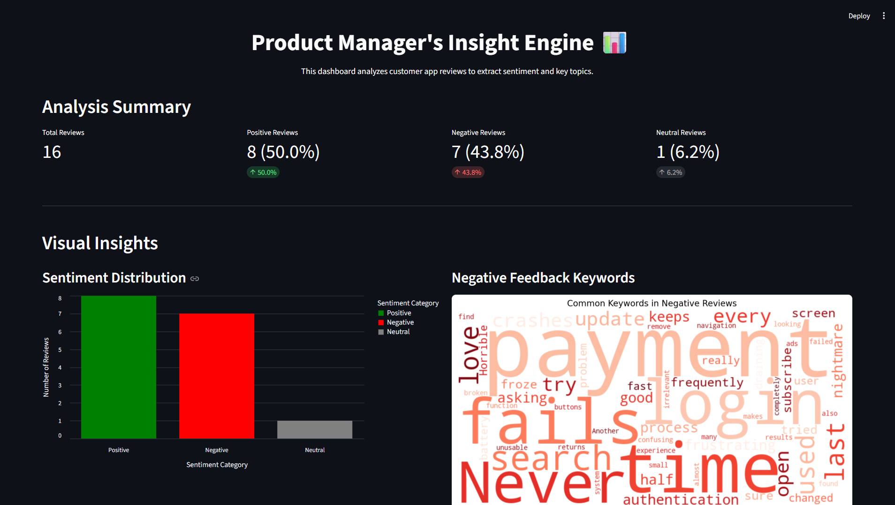
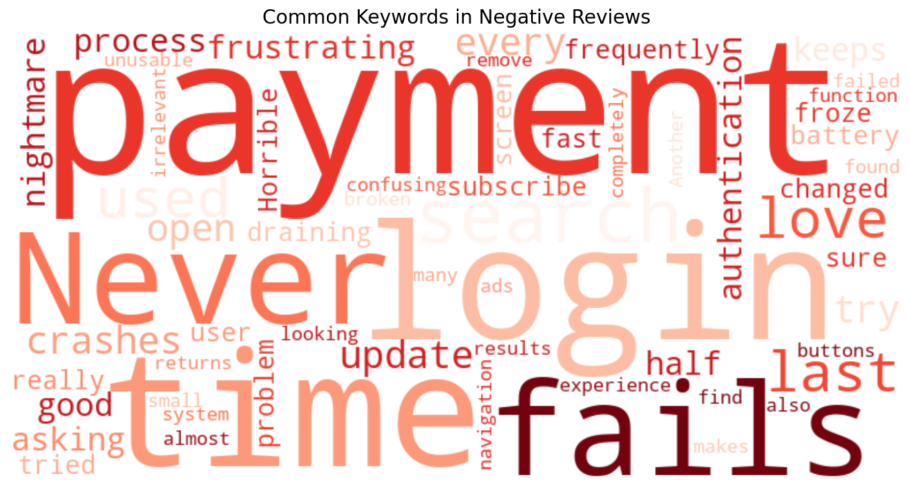
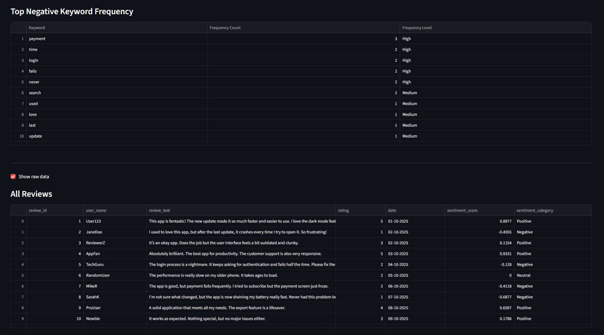

# Product Manager's Insight Engine: Sentiment Analysis Dashboard

This project is an interactive web dashboard built with Streamlit that automatically analyzes customer app reviews. It transforms raw, unstructured feedback into actionable insights for Product Managers, helping to identify user sentiment, pinpoint key pain points, and make data-driven decisions for the product roadmap.

---

## 📊 Live Dashboard Screenshots

Here is a full overview of the dashboard's interface and key insight sections.

### Main Dashboard


### Negative Keywords Word Cloud


### Top Negative Keyword Frequency


---

## ✨ Key Features

* **Interactive Dashboard:** A live, web-based UI built with Streamlit.
* **Real-Time Analysis:** Loads and analyzes a CSV of app reviews instantly.
* **At-a-Glance Metrics:** Displays high-level KPIs: Total Reviews, Positive %, Negative %, and Neutral %.
* **Interactive Sentiment Chart:** An interactive bar chart (built with Altair) showing the distribution of Positive, Negative, and Neutral reviews.
* **Visual Pain Point Identification:** Automatically generates a "Negative Keywords" word cloud to visually highlight the most common complaints.
* **Actionable Keyword Table:** A sortable table that lists the top negative keywords by frequency, ranked as "High," "Medium," or "Low" priority.
* **Raw Data Explorer:** An optional, expandable section to view and search the entire raw dataset.

---

## 🧰 Tech Stack

* **Core:** Python
* **Web App/Dashboard:** Streamlit
* **Data Analysis:** Pandas
* **NLP (Sentiment Analysis):** NLTK (VADER)
* **NLP (Tokenization):** NLTK (Punkt)
* **Interactive Charting:** Altair
* **Visualizations:** WordCloud, Matplotlib

---

## 👤 Author

**Ayush Saxena**
- GitHub: [iamAyushSaxena](https://github.com/iamAyushSaxena)
- LinkedIn: [Ayush Saxena](https://www.linkedin.com/in/ayush-saxena-39a300225/)
- Email: aysaxena8880@gmail.com

---

## ⚙️ Setup & Installation

1.  **Clone the repository:**
    ```bash
    git clone [https://github.com/your-username/product_insight_engine.git](https://github.com/your-username/product_insight_engine.git)
    cd product_insight_engine
    ```

2.  **Create a virtual environment (recommended):**
    ```bash
    python -m venv venv
    .\venv\Scripts\activate  # On Windows
    # source vVenv/bin/activate  # On Mac/Linux
    ```

3.  **Install the required libraries:**
    ```bash
    pip install -r requirements.txt
    ```

---

## 🏃‍♀️ How to Run the Project

With your virtual environment active, simply run the following command from your project's root directory:

```bash
streamlit run app.py
